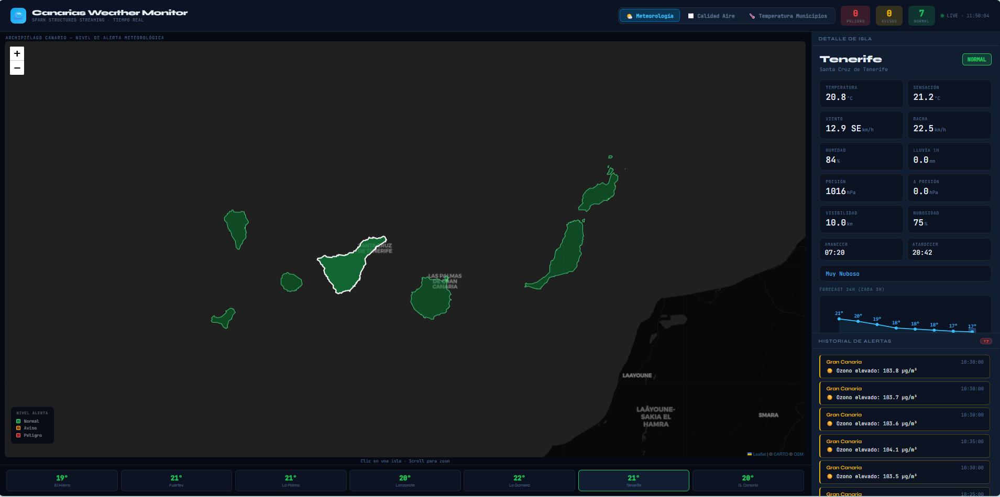
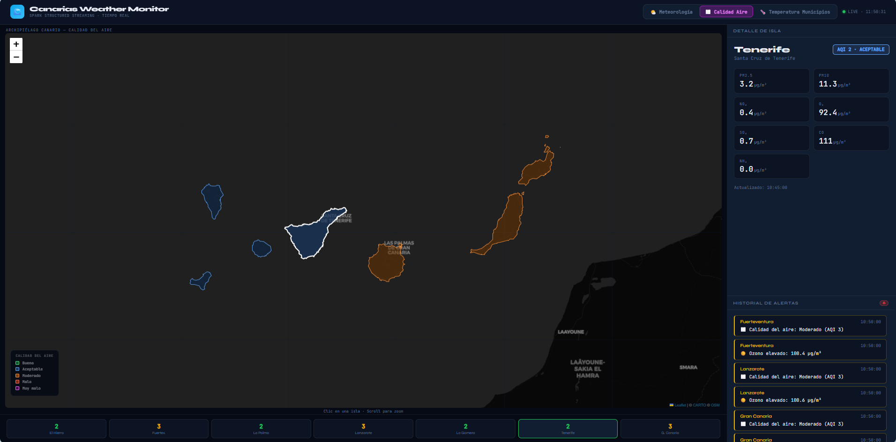
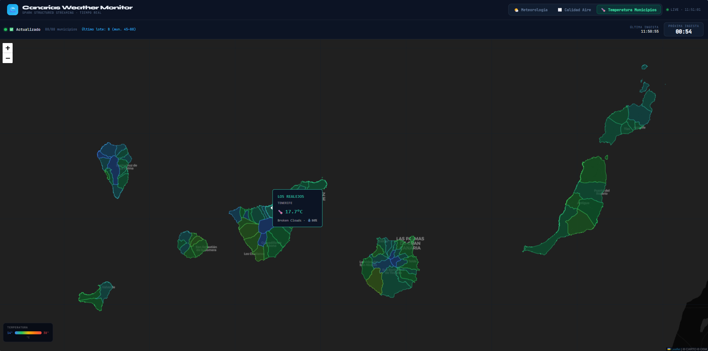

# 🌊 Canarias Weather Monitor

Sistema de vigilancia meteorológica en tiempo real sobre el **Archipiélago Canario**, construido con Apache Spark Structured Streaming, Flask y React. Monitoriza las 7 islas y los 88 municipios de Canarias con datos reales de OpenWeatherMap, procesando streams de datos continuos y generando alertas automáticas.

---

## Capturas de pantalla

### Panel Meteorológico


> _Panel meteorológico por islas. Información detallada._

### Panel de Calidad del Aire


> _Panel de calidad del aire por isla, con 5 niveles diferentes._

### Panel de Temperatura por Municipios


> _Panel de temperatura media por municipios. Actualización de 44 municipios/minuto._

---

## Arquitectura

```
OpenWeatherMap API
      │
      │  Current Weather · Air Pollution · Forecast 5 días
      │  (7 islas · poll cada 60s)
      ▼
 producer.py ──── TCP socket :9999 ────► PySpark Structured Streaming
                                                  │
                                        ventana deslizante 10 min
                                        detección de umbrales
                                        correlación multi-isla
                                        alertas meteorológicas + calidad aire
                                                  │
                                                  ▼
                                          Flask REST API
                                          │         │
                              Worker municipios   Endpoints
                              (88 mun. en 2 lotes    REST
                               de 44 · paralelo)
                                                  │
                                                  ▼
                                          React Frontend
                                     ┌────────────────────────┐
                                     │  Mapa Leaflet + GeoJSON │
                                     │  Panel meteorológico    │
                                     │  Panel calidad del aire │
                                     │  Panel municipios       │
                                     └────────────────────────┘
```

---

## Stack tecnológico

| Capa | Tecnología |
|------|-----------|
| Stream processing | Apache Spark 3.5.1 (PySpark Structured Streaming) |
| Productor de datos | Python 3.11 · requests |
| Backend REST | Flask 3.0 · Flask-CORS |
| Frontend | React 18 · Vite · Leaflet · CartoDB tiles |
| Datos geográficos | GeoJSON IGN/ISTAC (islas + municipios) |
| Fuente de datos | OpenWeatherMap API (Current Weather · Air Pollution · Forecast) |
| Orquestación | Docker · Docker Compose |
| Servidor web | Nginx |

---

## Requisitos

- Docker Desktop
- Docker Compose v2
- API Key gratuita de [OpenWeatherMap](https://openweathermap.org/api)

---

## Despliegue rápido

```bash
# 1. Clona o descarga el proyecto
cd canarias-weather

# 2. Crea el fichero de entorno con tu API key
cp .env.example .env
# Edita .env y añade tu clave real:
# OWM_API_KEY=tu_clave_aqui

# 3. Levanta todos los servicios
docker compose up --build

# 4. Abre el navegador
open http://localhost:3002
```

---

## Servicios Docker

| Servicio | Puerto local | Descripción |
|----------|-------------|-------------|
| `frontend` | 3002 | Interfaz React servida por Nginx |
| `backend` | 5001 | Flask REST API + worker de municipios |
| `producer` | 9999 | Socket TCP con datos OWM en tiempo real |
| `spark` | — | PySpark Structured Streaming |

> Los puertos pueden modificarse en `docker-compose.yml` si hay conflictos.

---

## Funcionalidades

### 🌤️ Panel Meteorológico

Monitorización en tiempo real de las **7 capitales de isla**:

- Temperatura, sensación térmica, humedad, presión atmosférica
- Velocidad y dirección del viento + racha máxima
- Precipitación última hora, nubosidad, visibilidad
- Detección de caídas de presión (frentes de tormenta)
- Amanecer y atardecer
- **Gráfica de forecast 24h** con temperatura y precipitación cada 3 horas
- Alertas automáticas por umbrales críticos

**Umbrales de alerta meteorológica:**

| Parámetro | 🟡 Aviso | 🔴 Peligro |
|-----------|---------|----------|
| Temperatura | — | > 38°C o < 5°C |
| Viento | > 60 km/h | > 78 km/h |
| Racha | > 60 km/h | > 90 km/h |
| Humedad | > 90% | — |
| Visibilidad | < 1.000 m | < 500 m |
| Δ Presión | > 3 hPa | > 6 hPa |
| Código OWM | — | 2xx (tormenta) |

---

### 🌫️ Panel de Calidad del Aire

Índice de calidad del aire y concentración de contaminantes por isla:

| Parámetro | Descripción |
|-----------|-------------|
| AQI | Índice global (1=Bueno → 5=Muy malo) |
| PM2.5 | Partículas finas (µg/m³) |
| PM10 | Partículas gruesas · indicador de **calima** |
| NO₂ | Dióxido de nitrógeno |
| O₃ | Ozono troposférico |
| SO₂ | Dióxido de azufre |
| CO | Monóxido de carbono |
| NH₃ | Amoniaco |

El mapa se recolorea con una escala propia (verde → azul → naranja → morado) según el AQI de cada isla. Los episodios de calima sahariana se detectan automáticamente cuando PM10 supera los umbrales de aviso.

---

### 🌡️ Panel de Temperatura por Municipios

Mapa de calor con los **88 municipios de Canarias** coloreados según su temperatura en tiempo real:

- **Gradiente de color:** azul (14°C) → verde (20°C) → amarillo (26°C) → naranja (32°C) → rojo (38°C)
- **Descarga inteligente en dos lotes** para respetar el límite de la API gratuita:
  - **Lote A** (municipios 1–44): se descarga en el minuto impar
  - **Lote B** (municipios 45–88): se descarga en el minuto par
  - Máximo 44 peticiones/minuto (límite: 60/min)
- **Solo activo cuando el usuario está en este panel** — el worker del backend se activa/pausa automáticamente
- Descarga paralela con 10 hilos concurrentes (~5 segundos por lote)
- Barra de estado con: estado del worker, municipios cargados, hora de última ingesta y **contador regresivo** hasta la próxima descarga

---

## API REST

| Endpoint | Método | Descripción |
|----------|--------|-------------|
| `/api/weather` | GET | Estado meteorológico actual de las 7 islas |
| `/api/alerts` | GET | Historial de alertas (últimas 100, deduplicadas) |
| `/api/forecast/<isla>` | GET | Forecast 24h en slots de 3h |
| `/api/municipios/temps` | GET | Temperaturas de los 88 municipios + estado worker |
| `/api/municipios/activate` | POST | Activa el worker de descarga de municipios |
| `/api/municipios/deactivate` | POST | Pausa el worker |
| `/api/ingest` | POST | Receptor de datos procesados desde Spark |
| `/api/health` | GET | Estado del backend |

---

## Procesamiento Spark

El job de Spark Structured Streaming aplica una **ventana deslizante de 10 minutos con deslizamiento de 5 minutos** sobre el stream de datos. Por cada ventana calcula:

- Temperatura media, presión media, viento máximo, racha máxima
- Caída de presión entre islas (detección de frentes)
- Nivel de alerta meteorológica (0=Normal, 1=Aviso, 2=Peligro)
- Nivel de alerta de calidad del aire (basado en AQI y concentraciones)

```python
windowed = parsed \
    .withWatermark("event_time", "5 minutes") \
    .groupBy(window("event_time", "10 minutes", "5 minutes"), "island", ...) \
    .agg(avg("temp"), spark_max("wind_speed"), spark_max("wind_gust"), ...)
```

---

## Límites de la API gratuita de OpenWeatherMap

| Endpoint | Uso en este proyecto | Límite gratuito |
|----------|---------------------|-----------------|
| Current Weather | 7 islas × 1/min = 7/min | 60/min · 1M/mes |
| Air Pollution | 7 islas × 1/min = 7/min | 60/min · 1M/mes |
| Forecast 5d/3h | 7 islas × 1/min = 7/min | 60/min · 1M/mes |
| Current Weather (municipios) | 44/min (solo panel activo) | 60/min |

---

## Detener

```bash
docker compose down
```

Para eliminar también los volúmenes:

```bash
docker compose down -v
```

---

## Licencia

Datos meteorológicos © [OpenWeatherMap](https://openweathermap.org) bajo licencia ODbL.
Datos geográficos © [ISTAC](https://www.gobiernodecanarias.org/istac/) — Gobierno de Canarias.
Tiles cartográficos © [CARTO](https://carto.com) · © [OpenStreetMap](https://openstreetmap.org) contributors.